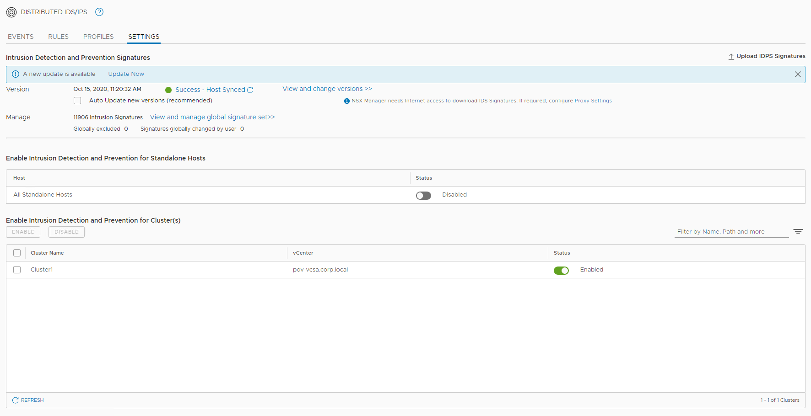
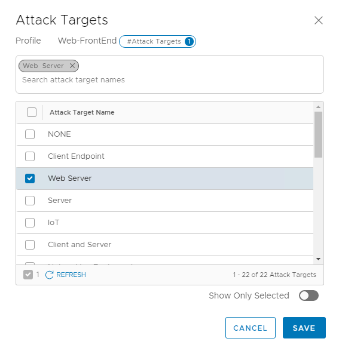
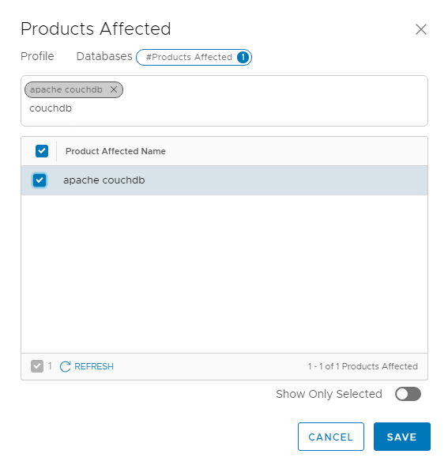
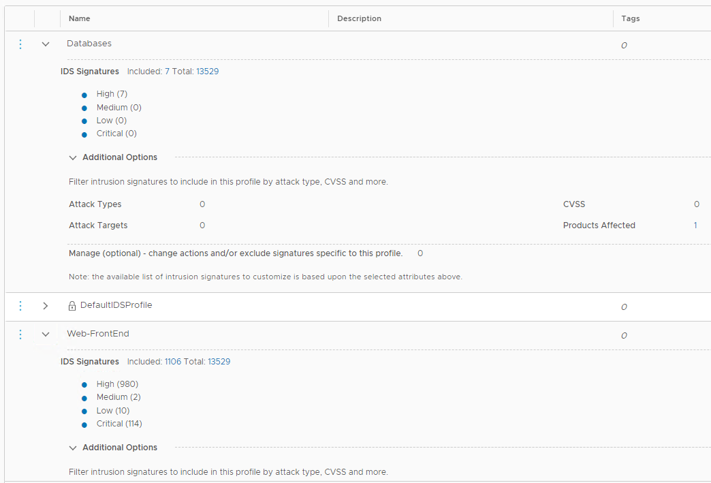

## 5. Initial IDS/IPS Configuration
**Estimated Time to Complete: 30 minutes**

> **Note**: If you are running though this Evaluation process using a VMWare hosted (OneCloud/HoL) environment, you can skip all the previous modules and start with this lab module (5), as everything has already been deployed. 

Now that we have verified the lab has been deployed correctly, basic NSX networking configuration has been applied and the appropriate vunlerable application VMs have been deployed, we can configure the NSX Distributed IDS/IPS.

**Create Groups**
1.	In the NSX Manager UI, navigate to Inventory -->  Groups 
2. Click **ADD GROUP**
3.	Create a Group with the below parameters. Click Save when done.
    * Name **Production Applications**
    * Compute Members: Membership Criteria: **Virtual Machine Tag Equals Production Scope Environment**
         
3.	Create another Group with the below parameters. Click Save when done.
    * Name **Development Applications**
    * Compute Members: Membership Criteria: **Virtual Machine Tag Equals Development Scope Environment**
4.	Create another Group with the below parameters. Click Save when done.
    * Name **Web-Tier**
    * Compute Members: Membership Criteria: **Virtual Machine Tag Equals Web-Tier Scope Tier**	
5.	Create another Group with the below parameters. Click Save when done.
    * Name **Web-Tier**
    * Compute Members: Membership Criteria: **Virtual Machine Tag Equals App-Tier Scope Tier**
    

6. Confirm previously deployed VMs became a member of appropriate groups due to applied tags. Click **View Members** for the 4 groups you created and confirm
    * Members of **Development Applications**: **APP-2-APP-TIER**, **APP-2-WEB-TIER**
    * Members of **Production Applications**: **APP-1-APP-TIER**, **APP-1-WEB-TIER**
	* Members of **Web-Tier**: **APP-1-WEB-TIER**, **APP-2-WEB-TIER**
    * Members of **App-Tier Applications**: **APP-1-APP-TIER**, **APP-2-APP-TIER**
        
    
> **Note**: Tags were applied to the workloads through the Powershell script used to deploy the lab environment.

**Apply Evaluation License or ATP license**

If you are the deployment script to deploy your own nested environment, and if you previously provide an NSX Evalution license key which enables all functionality including IDS/IPS, or if the required license is already present, you can skip this step. 
1.	In the NSX Manager UI, navigate to System --> License and upload either an ATP subscription license or an evaluation license
2.	Click **+ADD LICENSE** 
3.	Enter a valid license key and click **ADD**

**Enable Intrusion Detection**
1.	In the NSX Manager UI, navigate to Security -->  Distributed IDS/IPS --> Settings
2.	Under Enable Intrusion Detection for Cluster(s), change the toggle to **enabled** for the workload cluster

NSX can automatically update it’s IDS/IPS signatures by checking our cloud-based service. By default, NSX manager will check once per day and we publish new signature update versions every two week (with additional non-scheduled 0-day updates). NSX can also be configured to optionally automatically apply newly updated signatures to all hosts that have IDS enabled.

**Enable Automated Signature Update propagation**
1.	Under Intrusion Detection Signatures, select **Auto Update new versions (recommended)** in order to propagate the latest signature updates from the cloud to the distributed IDS/IPS instances
2.	Optionally, click **View and Change Versions** and expand one of the signature sets to see what signatures have been added/updated/disabled in this particular release 

> **Note**: if a proxy server is configured for NSX Manager to access the internet, click Proxy Settings and complete the configuration

**Create IDS/IPS Profiles**
1.	In the NSX Manager UI, navigate to Security -->  Distributed IDS/IPS --> Profiles
2. Click **ADD PROFILE**
3.	Create a Profile with the below parameters. Click Save when done.
    * Name **Web-FrontEnd**
    * Signatures to Include: **Attack Targets**: **Web Server**
	

3.	Create another Profile with the below parameters. Click Save when done.
    * Name **Databases**
    * Signatures to Include: **Products Affected**: **apache couchdb**

**Create IDS Rules**
1. In the NSX Manager UI, navigate to Security -->  Distributed IDS/IPS --> Rules
2. Click **ADD POLICY**
3. Create an IDS Policy named **NSX IDPS Evaluation** .
4. Check the checkbox for the policy you just created and click **ADD RULE**.
5. Add an IDS Rule with the following parameters
    * Name **Web-Tier Policy**
    * IDS Profile **Web-FrontEnd**
    * Applied to **Web-Tier** (group)
	* Mode **Detect Only**
    * Leave other settings to defaults
6. Add another IDS Rule with the following parameters
    * Name **App-Tier Policy**
    * IDS Profile **Databases**
    * Applied to **App-Tier** (group)
		* Mode **Detect Only**
    * Leave other settings to defaults
7. Click **Publish**

You have now successfully configured the NSX Distributed IDS/IPS ! In the next exercise, we will run through a basic attack scenario to confirm intrusion attemtps are detected and get familair with the NSX IDS/IPS Events view.

---

[***Next Step: 6. Basic Attack Scenario***](/docs/6-BasicAttackScenario.md)
